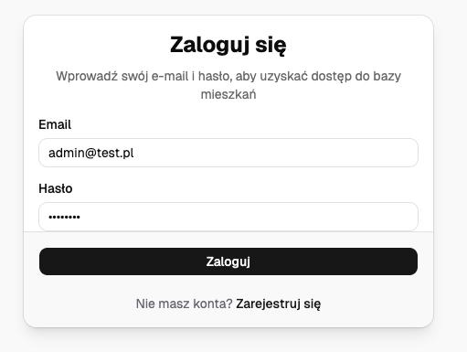
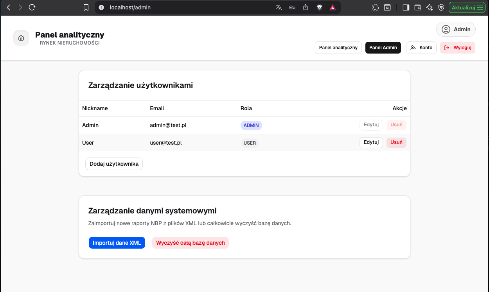
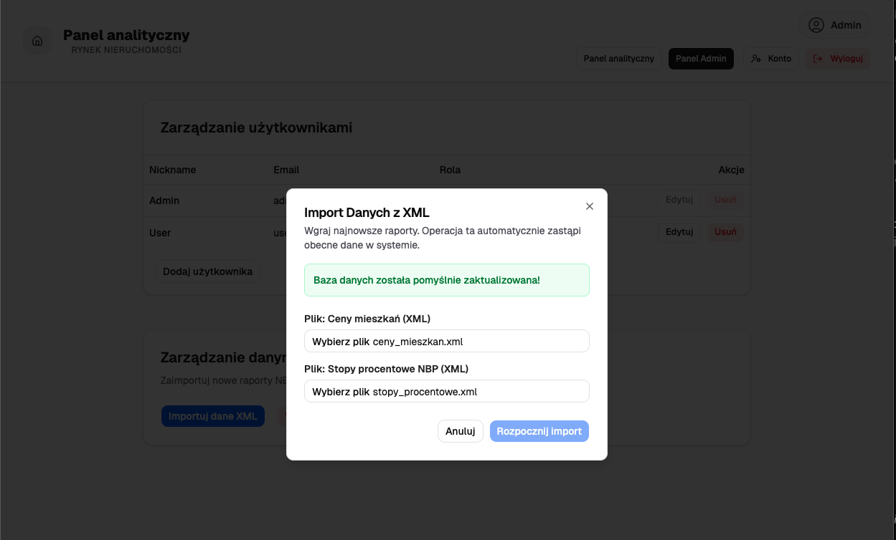
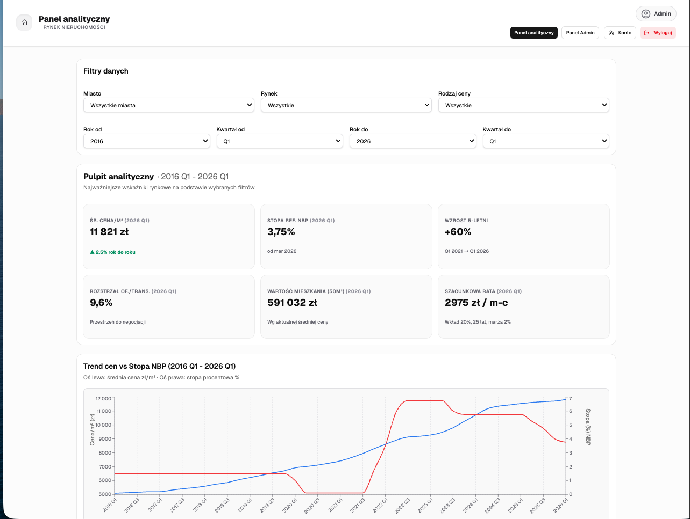

# System Integracji i Analizy Danych Rynku Nieruchomości

Aplikacja webowa typu Full-Stack służąca do analizy i wizualizacji danych z rynku nieruchomości w zestawieniu ze stopami procentowymi NBP. System realizuje pełne operacje CRUD na wielu powiązanych tabelach (m.in. Miasta, Ceny mieszkań, Stopy procentowe, Użytkownicy). 
Aplikacja została zaprojektowana w architekturze mikroserwisowej i skonteneryzowana za pomocą technologii Docker.

## Główne funkcjonalności:
- **Zaawansowany pulpit analityczny:** Dynamiczne generowanie wykresów z wykorzystaniem filtracji po latach i kwartałach.
- **Zarządzanie Użytkownikami (Admin Panel):** Pełny CRUD (tworzenie, edycja z uploadem awatara, usuwanie, podgląd).
- **Import/Eksport Danych:** Importowanie raportów z plików XML do bazy oraz eksportowanie gotowych analiz do formatów JSON, YAML i XML.
- **Zabezpieczenia:** Autoryzacja bazująca na tokenach JWT (HttpOnly Cookies), szyfrowanie haseł (Bcrypt) i walidacja danych (Zod).

## Użyte Technologie:

1. **Frontend (`/frontend`)**: React.js, Vite, Recharts (Wizualizacja danych), Tailwind CSS, shadcn/ui (Stylowanie).
2. **Backend (`/backend`)**: Node.js, Express.js, Prisma ORM, Zod (Walidacja), JWT & BCrypt (Autoryzacja).
3. **Baza danych**: PostgreSQL (tabele: `City`, `HousingPrice`, `InterestRate`, `User`).

## Instrukcja uruchomienia 

Projekt można uruchomić na dwa sposoby: wykorzystując narzędzie Docker Compose (zalecane) lub czyste komendy Docker CLI.

Przed uruchomieniem aplikacji upewnij się, że masz zainstalowane środowisko Docker. Ponieważ aplikacja do działania wymaga poufnych danych (np. haseł, kluczy szyfrujących), nie są one trzymane w repozytorium. Zamiast tego dostarczone są pliki szablonowe `.env.example`.

---

### Krok 0: Konfiguracja zmiennych środowiskowych (Wymagane)

Przed zbudowaniem obrazów musisz utworzyć trzy pliki `.env` w odpowiednich katalogach na podstawie plików `.env.example`. 

**1. Główny katalog projektu (tam gdzie docker-compose.yml):**
Utwórz plik `.env` i zdefiniuj w nim hasło główne do bazy danych:
```env
POSTGRES_PASSWORD=TwojeWlasneHaslo123
```

**2. Katalog Backendu (`/backend`):**
Utwórz plik `.env` i dodaj w nim tajny klucz dla autoryzacji JWT:
```env
JWT_SECRET=dowolny_dlugi_i_skomplikowany_ciag_znakow
```
*(Uwaga: Zmienna DATABASE_URL w środowisku Docker jest automatycznie nadpisywana przez konfigurację kontenerów).*

**3. Katalog Frontendu (`/frontend`):**
Utwórz plik `.env` i wskaż w nim adres API dla aplikacji klienckiej:
```env
VITE_API_URL=/api
```

---

### Opcja 1: Uruchomienie za pomocą Docker Compose (Zalecane)

Docker Compose automatyzuje cały proces budowania i łączenia kontenerów na podstawie konfiguracji zawartej w pliku `docker-compose.yml`. Migracje bazy danych oraz proces jej zasilania (seeding) zostaną wykonane automatycznie.

**1. Zbudowanie i uruchomienie aplikacji:**
W głównym katalogu projektu, tam gdzie znajduje się plik `docker-compose.yml`, wykonaj polecenie:
```bash
docker compose up -d --build
```
Flaga `-d` uruchamia kontenery w tle (detached mode), a `--build` wymusza świeże zbudowanie obrazów na podstawie plików Dockerfile.

**2. Zatrzymanie aplikacji:**
```bash
docker compose down
```

---

### Opcja 2: Uruchomienie za pomocą Docker CLI

Ten sposób wymaga ręcznego utworzenia sieci, zbudowania obrazów i uruchomienia każdego kontenera po kolei. Pamiętaj, aby wcześniej skonfigurować pliki `.env` (jak opisano w Kroku 0). W poniższych komendach dla ułatwienia przyjęto hasło `TwojeWlasneHaslo123` oraz klucz `moj_tajny_klucz`.

**0. Upewnij się, że znajdujesz się w głównym folderze projektu.**

**1. Utworzenie współdzielonej sieci dla kontenerów:**
```bash
docker network create network
```

**2. Uruchomienie bazy danych PostgreSQL:**
```bash
docker run -d \
  --name db \
  --network network \
  -e POSTGRES_USER=admin \
  -e POSTGRES_PASSWORD="TwojeWlasneHaslo123" \
  -e POSTGRES_DB=real_estate_db \
  -v pgdata:/var/lib/postgresql/data \
  -p 5432:5432 \
  postgres:15-alpine
```
Poczekaj kilka sekund, aż baza w pełni się uruchomi.

**3. Budowanie obrazu i uruchomienie backendu:**
```bash
docker build -t backend ./backend

docker run -d \
  --name backend \
  --network network \
  -e PORT=3000 \
  -e JWT_SECRET="moj_tajny_klucz" \
  -e DATABASE_URL="postgresql://admin:TwojeWlasneHaslo123@db:5432/real_estate_db?schema=public" \
  -p 3000:3000 \
  backend
```

**4. Wykonanie migracji oraz seedowanie bazy danych:**
Ponieważ baza danych jest czysta, musimy zaaplikować schemat Prismy i wypełnić ją początkowymi danymi, wykonując komendy wewnątrz działającego kontenera backendu:
```bash
docker exec backend npx prisma migrate deploy
docker exec backend node usersSeed.js
```

**5. Budowanie obrazu i uruchomienie frontendu:**
Ponieważ plik `./frontend/.env` został przygotowany w Kroku 0, proces budowania poprawnie osadzi zmienną `VITE_API_URL` w plikach statycznych.
```bash
docker build -t frontend ./frontend

docker run -d \
  --name frontend \
  --network network \
  -p 80:80 \
  frontend
```

Po wykonaniu tych kroków aplikacja jest gotowa do uruchomienia. Frontend jest dostępny pod adresem `http://localhost`, a API backendu pod `http://localhost:3000`.

---

## Instrukcja obsługi aplikacji (szybki start)

### 1. Konta testowe

Do przetestowania wszystkich funkcji systemu przygotwano następujące konta:

- **Administrator (pełen dostęp):**
    - **Email:** `admin@test.pl`
    - **Hasło:** `admin123`
- **Zwykły użytkownik (dostęp do odczytu/zmiany personalnych danych):**
    - **Email:** `user@test.pl`
    - **Hasło:** `user123`

### 2. Importowanie danych z pliku XML

Aby zasilić bazę danych informacjami i wygenerować wykresy na pulpicie analitycznym, wykonaj następujące kroki:

1. Zaloguj się do aplikacji wykorzystując poświadczenia Administratora.



2. Z górnego menu wybierz Panel Admina (lub przejdź bezpośrednio pod adres http://localhost/admin).



3. Znajdź i kliknij niebieski przycisk "Importuj dane XML".

4. W otwartym oknie modalnym wskaż i zaimportuj pliki testowe (`ceny_mieszkan.xml` oraz `stopy_procentowe.xml`, które są umieszczone w folderze `/backend/data` projektu).



5. Po pomyślnym imporcie przejdź do zakładki Dashboard. Aplikacja automatycznie przetworzy nowe dane i wygeneruje interaktywne wykresy analityczne.



---

## Struktura projektu

Aplikacja została zaprojektowana z wyraźnym podziałem na część serwerową (backend) oraz kliencką (frontend), co wpasowuje się w środowisko mikroserwisowe i ułatwia konteneryzację. Poniżej znajduje się drzewo katalogów wraz z opisem najważniejszych warstw architektury.

```bash
├── backend
│   ├── import.js
│   ├── package-lock.json
│   ├── package.json
│   ├── prisma
│   │   ├── README.md
│   │   └── schema.prisma
│   ├── prisma.config.js
│   ├── src
│   │   ├── config
│   │   │   └── db.js
│   │   ├── generated
│   │   │   └── prisma
│   │   ├── middleware
│   │   │   └── auth.js
│   │   ├── routes
│   │   │   ├── authRoutes.js
│   │   │   ├── dataRoutes.js
│   │   │   ├── exportRoutes.js
│   │   │   ├── importRoutes.js
│   │   │   └── userRoutes.js
│   │   ├── server.js
│   │   ├── services
│   │   │   ├── importHousingPrices.js
│   │   │   ├── importInterestRates.js
│   │   │   └── reportService.js
│   │   └── validations
│   │       ├── dataSchemas.js
│   │       ├── exportSchemas.js
│   │       ├── importSchemas.js
│   │       └── userSchemas.js
│   └── usersSeed.js
├── frontend
│   ├── components.json
│   ├── eslint.config.js
│   ├── index.html
│   ├── jsconfig.json
│   ├── package-lock.json
│   ├── package.json
│   ├── public
│   │   ├── favicon.svg
│   │   └── icons.svg
│   ├── README.md
│   ├── src
│   │   ├── App.jsx
│   │   ├── assets
│   │   │   ├── hero.png
│   │   │   ├── react.svg
│   │   │   └── vite.svg
│   │   ├── components
│   │   │   ├── admin
│   │   │   ├── charts
│   │   │   ├── dashboard
│   │   │   ├── layout
│   │   │   └── ui
│   │   ├── hooks
│   │   │   ├── useCurrentUser.js
│   │   │   ├── useDashboardData.js
│   │   │   └── useDashboardMath.js
│   │   ├── index.css
│   │   ├── lib
│   │   │   └── utils.js
│   │   ├── main.jsx
│   │   └── pages
│   │       ├── Account.jsx
│   │       ├── AdminPanel.jsx
│   │       ├── Calculator.jsx
│   │       ├── Dashboard.jsx
│   │       ├── Login.jsx
│   │       └── Register.jsx
│   └── vite.config.js
└── README.md
```

### Backend (Node.js / Express)
W części serwerowej zastosowaliśmy czytelny podział odpowiedzialności:
* **`src/routes/`** – Definicje endpointów API. Trasy zostały pogrupowane (np. oddzielne pliki dla autoryzacji, eksportu czy importu danych).
* **`src/services/`** – Warstwa logiki biznesowej. Tutaj znajdują się skrypty odpowiedzialne za trudniejsze operacje, takie jak parsowanie plików XML, algorytmy grupujące stopy procentowe i generowanie raportów do formatów XML/JSON/YAML.
* **`src/validations/`** – Schematy walidacyjne oparte na bibliotece Zod, gwarantujące poprawność danych trafiających do bazy.
* **`src/middleware/`** – Oprogramowanie pośredniczące, zawierające głównie logikę bezpiecznej weryfikacji ciasteczek HttpOnly oraz ról użytkowników (JWT).
* **`prisma/`** – Pliki konfiguracyjne ORM, w tym główny szkielet bazy danych (`schema.prisma`).
* **`usersSeed.js`** – Skrypt inicjalizujący (seed), który tworzy konta testowe przy pierwszym uruchomieniu kontenera bazy.

### Frontend (React / Vite)
Część kliencka opiera się na reużywalnych komponentach i autorskich hookach:
* **`src/components/`** – Zbiór komponentów interfejsu (UI) z podziałem na domeny biznesowe: moduły analityczne (`charts`), elementy pulpitu (`dashboard`) oraz panel administracyjny (`admin`).
* **`src/hooks/`** – Wyizolowana logika biznesowa i stany. Znajduje się tu m.in. kluczowy dla aplikacji plik `useDashboardMath.js`, odpowiedzialny za agregację i przeliczanie surowych danych rynkowych na wartości wyświetlane na wykresach.
* **`src/pages/`** – Główne widoki aplikacji (widok logowania, główny pulpit analityczny, panel administratora), które składają mniejsze komponenty w całe strony.
* **`src/lib/`** – Funkcje narzędziowe (utils).

---

## Wykorzystanie narzędzi AI

Ze względu na charakter pracy oraz korzystanie z asystentów wbudowanych w edytory kodu, które nie zapisują trwałej historii konwersacji, poniżej udostępniamy zachowane materiały oraz szczegółowe podsumowanie obszarów, w których wykorzystywaliśmy AI.

### 1. Załączone materiały i linki

* **Rozwiązywanie problemów z Dockerem (Gemini):** [https://gemini.google.com/share/237a0615b4b6](https://gemini.google.com/share/237a0615b4b6)
* **Rozwiązywanie konfliktów git merge:** [https://gemini.google.com/share/28c189882ab4](https://gemini.google.com/share/28c189882ab4)
* **Transkrypty z edytora Cursor:** Zachowane logi z pracy z wbudowanym asystentem znajdują się w folderze `./docs/ai_logs`:
  - `cursor_dashboard_ui_redesign.md`
  - `cursor_edit_user_information.md`

### 2. Fragmenty kodu wygenerowane przez AI i nasz wkład

Poniżej wskazujemy konkretne pliki i linie kodu, wskazujemy rozwiązany problem oraz opisujemy, jak zmodyfikowaliśmy kod wygenerowany przez AI:

* `backend/src/middleware/auth.js` **(linie 4-24)** oraz `backend/src/routes/authRoutes.js` **(linie 84-142)**
  * **Kontekst:** Bezpieczeństwo i architektura autoryzacji użytkowników z użyciem JWT.
  * **Co zrobiło AI:** Wygenerowanie podstawowej logiki weryfikacji i przesyłania tokena w nagłówku `Authorization` (Bearer) z domyślnym założeniem przechowywania go w `localStorage` po stronie klienta.
  * **Nasza modyfikacja:** Ze względów bezpieczeństwa (ochrona przed atakami typu XSS) zrezygnowaliśmy z `localStorage`. Całkowicie przebudowaliśmy logikę logowania i middleware, przenosząc zapis oraz odczyt tokenów do bezpiecznych ciasteczek (`req.cookies`) z wykorzystaniem flag `httpOnly: true`, `secure` oraz `sameSite: "lax"`.

* `backend/src/validations/importSchemas.js` **(linie 2-6 i 37-61)**
  * **Kontekst:** Problem z walidacją nieustrukturyzowanych danych z plików XML.
  * **Co zrobiło AI:** Wygenerowanie funkcji `forceArray` oraz szkieletu bloku `superRefine`.
  * **Nasza modyfikacja:** Dodanie autorskiego algorytmu sprawdzania spójności, ręczna weryfikacja istnienia kwartałów i poprawa przekazywania komunikatów o błędach.

* `backend/src/routes/exportRoutes.js` **(linie 35-88)**
  * **Kontekst:** Konfiguracja eksportu przetworzonych danych JSON do formatów XML/YAML.
  * **Co zrobiło AI:** Wygenerowanie bazowych endpointów yaml/xml z użyciem biblioteki `xml2js`.
  * **Nasza modyfikacja:** Zmiana biblioteki na wydajniejszy `fast-xml-parser` oraz ręczne ustawienie odpowiednich nagłówków (Headers) w odpowiedzi HTTP.

* `backend/src/services/importInterestRates.js` **(linie 29-87)**
  * **Kontekst:** Przetwarzanie i grupowanie surowych danych o stopach procentowych NBP.
  * **Co zrobiło AI:** Napisanie prostej funkcji grupującej rekordy do wstawienia.
  * **Nasza modyfikacja:** Zaimplementowanie złożonej logiki i algorytmu automatycznie kalkulującego i wypełniającego puste miesiące na osi czasu.

* `frontend/src/hooks/useDashboardMath.js` **(linie 43-195)** oraz `frontend/src/pages/Dashboard.jsx`
  * **Kontekst:** Renderowanie wykresów analitycznych (Recharts) i przeliczanie danych rynkowych.
  * **Co zrobiło AI:** Wygenerowanie algorytmów agregujących dane (m.in. dynamika r/r). Początkowo AI wygenerowało całą strukturę wizualną wykresów bezpośrednio w głównym pliku `Dashboard.jsx`.
  * **Nasza modyfikacja:** Gruntowna refaktoryzacja kodu. Logikę matematyczną przenieśliśmy do dedykowanego hooka `useDashboardMath.js`. Odrzuciliśmy monolityczną strukturę i wydzieliliśmy każdy wykres do osobnych komponentów (np. `CityPriceChart`, `MarketTypePricesChart`), zagnieżdżając je w komponentach typu Card (np. `PriceTrendCard`, `MomentumCard`) w celu zachowania czystości kodu oraz dodaliśmy filtry ignorujące skrajne wartości.